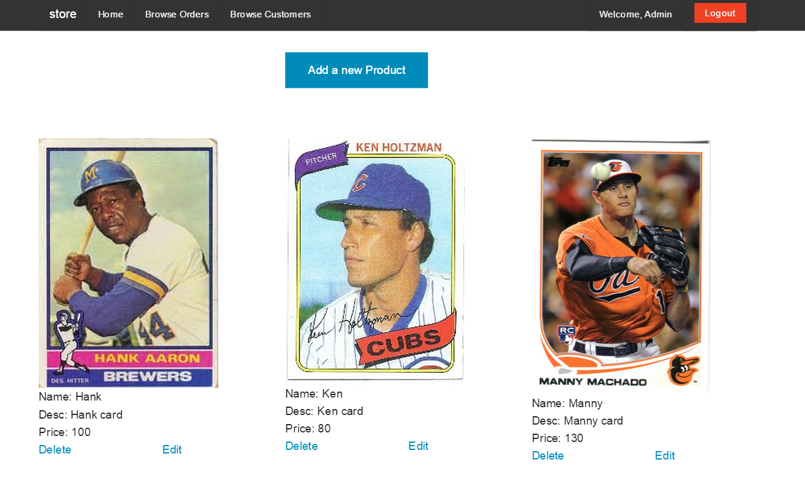
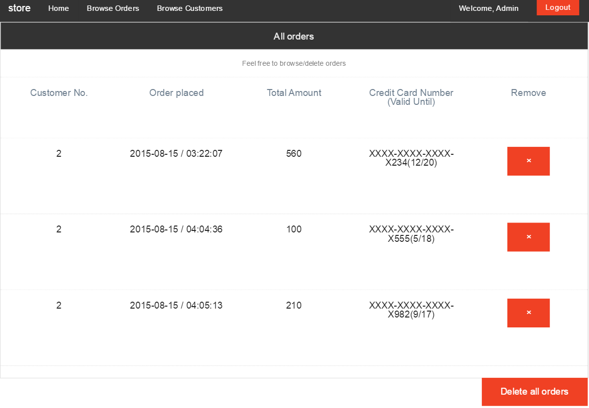
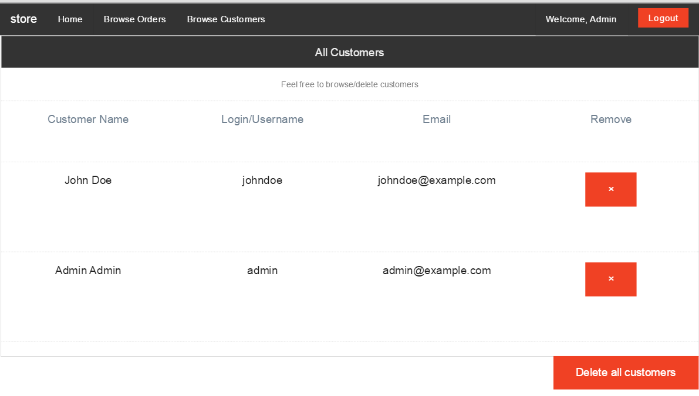

## eStore

eStore is a simple shopping cart built entirely from scratch in PHP.

[Live Demo](http://pawar-demo-estore.herokuapp.com/index.php/store/index) <br>
<i>Note: Heroku apps take a few minutes to start up. Be patient</i> :)

Test credentials: <br>
```username: johndoe```<br>
```pass: password```

Technologies:
* PHP
* MySQL
* Javascript, jQuery
* CSS


### Features
* User login/signup
* Credit-card validation
* Email receipt <i>(disabled in live demo)</i>
* Admin privileges
  * Add, delete and edit products
  * Display all finalized orders
  * Delete all customer and order information


### Admin page
To prevent abuse, admin page has been disabled.<br>
Here are a few screenshots of what Admin can do:

* Option to Edit products <br><br>
 <br><br>

* Display all orders <br><br>
 <br><br>

* Display all customers <br><br>

